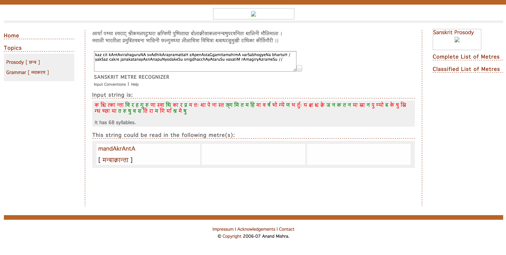

(A retrospective history of the project, being written in early 2015.)

# Background: before the first commit

For a while, I was using the Sanskrit Metre Recognizer by
[Anand Mishra](http://www.sai.uni-heidelberg.de/abt/IND/mitarbeiter/mishra/mishra.php),
available at <http://sanskrit.sai.uni-heidelberg.de/Chanda/>

It [takes input in Harvard-Kyoto transliteration](http://sanskrit.sai.uni-heidelberg.de/SiteInfo/inputConventions.html),
and produces output as in the following screenshot (I have re-entered the input
in the box, for illustration).

I found it very useful, but note some obvious deficiencies (which I'll revisit later):

 1. It takes input only in Harvard-Kyoto (HK) transliteration.

 2. While _laghu_ and _guru_ syllables (in Devanāgarī) are highlighted in
    colour, all the syllables of the verse are dumped consecutively with spaces
    between them, making the verse hard to read.

 3. An error in a single syllable anywhere in the interior of any _pāda_ of the
    verse makes the recognizer fail to identify the metre.

Anyway, I was using this recognizer for quite some time, and reasonably happily
too, never giving a thought to implementing an alternative myself.

On 2013-10-12, Sri G S S Murthy made
[a post to the sanskrit-programmers mailing list](https://groups.google.com/d/msg/sanskrit-programmers/8jhfDaawkWI/F7VFZObagTIJ)
in which he mentioned a Java application he had written for recognizing Sanskrit
metres. Though I ignored the actual application (it was a Windows-only
executable, and I did not have a Windows machine), this was the first time it
occurred to me that it may not be very hard to write such a thing.

This post was followed by a typical bordering-on-rude reply by Mārcis Gasūns
(why does it take Baraha input? a command-line tool is so 1995! etc.), but he
followed it up on 2013-10-14 with a link to the `sscan` Perl script from
[sktutils.zip by (AFAICT) John Smith](http://bombay.indology.info/software/programs/).
I did not examine [the code](http://pastie.org/8400820) much, not being a fluent
reader of Perl (is anyone?) or of the CSX encoding, but the script's sheer
conciseness (61 lines including a description and boilerplate and everything)
made me finally curious enough to attempt understanding it and writing my own in
Python.

# The first commit

    beef04b 2013-10-15 09:33:53 +0530

Just a few hours later I committed the
[first version of the code](https://github.com/shreevatsa/sanskrit/blob/beef04b5417057bf62acc411ea3a200adfe607fe/sscan.py)
to the Git repository. It was called `sscan.py` (the inspiration from the Perl
script `sscan` is evident!), stood at 50 lines long, and did one simple thing:
it took lines in HK, and replaced them with a pattern of "-"s and "u"s, standing
for _guru_s and _laghu_s respectively.

For testing I used a text of Meghadūta (from GRETIL and transliterated by myself
into HK using
[a transliterator I had written years earlier](http://shreevatsa.appspot.com/sanskrit/transliterate.html)).
As I knew the Meghadūta to be entirely in the Mandākrāntā metre, the intent was
to verify that the program identifies each line as Mandākrāntā, namely one of
these two:

    - - - - u u u u u - - u - - u - -
    - - - - u u u u u - - u - - u - u

The algorithm of the initial version was very similar to what I could understand
of `sscan`:

 0. Drop all punctuation and whatever is not a vowel or consonant.

 1. Interpret all long vowels, along with any consonants that follow them, as
    _guru_.

 2. Interpret any vowel (only short vowels would be left now) followed by
    multiple consonants as _guru_.

 3. Interpret remaining vowels followed by consonants (only short vowels
    followed by single consonants would be left now) as _laghu_.

 4. Ignore consonants at the beginning of the line, which have been left
    uninterpreted so far.

 5. Presumably everything in the line has been interpreted so far. Done.

As it took input in HK, the first version involved some hacks, similar to the
one `sscan` used for handling CSX:

 - Dealing with multiple-character consonants, namely _mahāprāṇa_ consonants
   like "kh", by simply dropping the "h": this does not affect the metre, as a
   consonant is still a consonant.

 - Dealing with multiple-character vowels like _ai_ and _au_ by replacing them
   with other vowels that have the same metrical value.

Another idea, still in use, is to treat _anusvāra_ and _visarga_ as consonants
too. This makes perfect sense:

 - vowel + (_anusvāra_ or _visarga_) + consonant is _guru_, just as
   vowel + (consonant) + consonant is _guru_.

but I am not aware of any text on prosody treating them as such. This is a
unique insight that the technological constraints (or laziness) have given us!

# Refactoring

    9b9ff8f 2013-10-15 10:02:24 +0530 Refactor into MassageHK + MetricalPattern
    7161558 2013-10-15 10:05:32 +0530 "line" -> "text"
    d1c1ce3 2013-10-16 09:55:15 +0530 Display 'L' and 'G' instead of 'u' and '-'

Already the hints of the current modular system were there: refactored into two
functions, one to deal with the input ("massaging" it into easier-to-scan form),
and one to actually scan the cleaned-up input.

# Unexpected utility

Running the program on the text of the Meghadūta uncovered metrical errors in
the text, so what was intended to be mere testing very quickly morphed into a
subproject to fix the errors in that particular GRETIL text of the Meghadūta.

In all, the program found
[23 errors](https://github.com/shreevatsa/sanskrit/blob/f2ef736466021b785461fc4dc11f04480e74d7fd/meghdk_u_errors.txt)
in the 100-odd verses: and these were metrical errors alone!

    b1e88dc 2013-10-16 21:51:28 +0530 Add meghdk_hk.txt (transliterated from GRETIL)
    cdb4bb2 2013-10-17 12:34:50 +0530 Fix error in 1.42
    e7b5616 2013-10-17 21:29:55 +0530 Fix error in 1.43
    cd5aa7c 2013-10-17 21:39:03 +0530 Fix error in 1.44
    4d0097c 2013-10-17 21:39:19 +0530 List of errors (a dozen already)
    5cc5595 2013-10-17 22:35:42 +0530 Fix error in 1.55
    0673984 2013-10-18 07:37:39 +0530 Fix error in 2.1 and 2.3
    7836322 2013-10-18 08:45:43 +0530 Fix error in 2.6
    7397813 2013-10-18 08:47:12 +0530 Fix error in 2.7
    ac91c1b 2013-10-18 08:49:06 +0530 Fix error in 2.10
    a29c693 2013-10-18 08:52:37 +0530 Fix error in 2.22
    c595ee5 2013-10-18 10:53:00 +0530 Fix error in 2.27
    e24d7a6 2013-10-18 10:55:44 +0530 Fix error in 2.28
    382e01f 2013-10-18 13:45:22 +0530 Fix error in 2.30
    63ca2dc 2013-10-18 13:46:30 +0530 Fix error in 2.30
    4b33352 2013-10-18 13:48:02 +0530 Fix error in 2.31
    f60a744 2013-10-18 13:51:26 +0530 [rm blank lines]
    f2ef736 2013-10-18 14:57:58 +0530 [reword error list]
    c43dd8c 2013-10-18 14:58:46 +0530 Removed meghdk_hk.txt and meghdk_u_errors.txt
    1952fdf 2013-10-19 11:07:58 +0530 Added back meghdk_u_errors.txt

# Identifying metres

Although `sscan` printed only the pattern of _laghu_-s and _guru_-s in each
line, I knew that what I ultimately wanted was something that can actually
identify the metre, like Anand Mishra's Heidelberg site.

    f2bb69f 2013-10-19 17:35:24 +0530 [sort imports, rewrite docstrings]
    8b557da 2013-10-19 19:15:40 +0530 Internally, use -+ instead of u-
    d0b7f53 2013-10-19 20:47:36 +0530 IdentifyPattern as another function

I refactored "IdentifyPattern" as another function; now there were 3 modules:
handling the input, translating it to a metrical pattern (pattern of _laghu_-s
and _guru_-s), and then identifying the pattern. So far, "identifying" the
pattern only meant saying whether it matched that of _Mandākrāntā_ or
not. Instead, the goal would be to say whether it matched _any_ of a
list of known metres, and if so, which.

    b194fa3 2013-10-20 06:04:36 +0530 Table of known metres
    89106bd 2013-10-20 11:02:56 +0530 Check-fail on non-HK characters
    27df1df 2013-10-20 11:17:32 +0530 Refactor CheckHK as a function

    known_metres = {
      'GGGGLLLLLGGLGGLG.': 'mandākrāntā'
    }
    def IdentitfyPattern(pattern):
      metre = None
      for known_pattern, known_metre in known_metres.iteritems():
        if re.match('^' + known_pattern + '$', pattern):
          metre = known_metre

The
[version at this point](https://github.com/shreevatsa/sanskrit/blob/b194fa36476340006ad8dd24144b318a9b372639/sscan.py)
(early on 2013-10-20) had only one metre; I set about adding more.

# Identifying metres vs identifying pattern

The initial text I used for testing, which had a _pāda_ of _Mandākrāntā_ on each
line, led to another innovation that was absent in the Heidelberg site:
recognizing the metre from part of a verse, not necessarily an entire verse.

(On the Heidelberg site, if you have a single _pāda_ of a verse and want to
identify its metre, you can do so by entering the same _pāda_ four times -- this
will work if the metre is a _sama-vṛtta_.)

    fe72ff9 2013-10-20 17:00:56 +0530 IdentifyMetre(verse) vs IdentifyPattern

    known_patterns = {
        'GGGGLLLLLGGLGGLGL': 'mandākrāntā_pāda',
        'GGGGLLLLLGGLGGLGG': 'mandākrāntā_pāda'
    }
    known_metres = {
        'GGGGLLLLLGGLGGLG.' * 4: 'mandākrāntā'
    }

    def IdentitfyPattern(pattern):
      ...
      return known_patterns.get(pattern)

    def IdentifyMetre(verse):
      for known_pattern, known_metre in known_metres.iteritems():
        if re.match('^' + known_pattern + '$', full_verse):
          return known_metre

      if len(verse) == 4:
        for i in range(4):
          line_i = verse[i]
          print 'Line %d: pattern %s is %s' % (i, line_i, IdentitfyPattern(line_i))

In hindsight, I think it was a mistake to have functions with
side-effects (including details of display down to the level of
indentation). Too much state.

    5842d67 2013-10-20 17:09:38 +0530 IdentifyMetre on entire input
    4459e2a 2013-10-21 07:50:40 +0530 Fewer global variables
    8b9e4fb 2013-10-21 09:04:30 +0530 Lint fixes
    1a0f6db 2013-10-21 09:52:44 +0530 Populate tables with "AddSamavrtta"

    -known_patterns = {
    -    'GGGGLLLLLGGLGGLGL': 'mandākrāntā_pāda',
    -    'GGGGLLLLLGGLGGLGG': 'mandākrāntā_pāda'
    -}
    -known_metres = {
    -    'GGGGLLLLLGGLGGLG.' * 4: 'mandākrāntā'
    -}

    +known_patterns = {}
    +known_metres = {}
    + ...
    +  AddSamavrtta('mandākrāntā', 'GGGGLLLLLGGLGGLG.')

Then I set about adding more metres, based on the ones recognized as important,
from
[my conversation with Dr. Ganesh](https://www.youtube.com/playlist?list=PLABJEFgj0PWVXr2ERGu2xtoSXrNdBs5xS).

    3e09cc1 2013-10-21 09:55:24 +0530 Added Upajāti and Vaṃśastha
    1845edd 2013-10-21 13:53:11 +0530 Added 13 more metres: Rathoddhatā...Mālinī
    bf060da 2013-10-21 13:54:34 +0530 Added 2 more metres
    6a0f523 2013-10-21 13:55:06 +0530 Added spaces including yati in Mandākrāntā
    4a0f01e 2013-10-21 21:59:11 +0530 AddSamavrtta -> (AddVrtta, AddArdhasamvrtta)

(Anuṣṭup was added as an Ardhasamavṛtta `('....LGGG', '....LGLG')`, with the
dots expanding to all 2^8=256 options.)

Note also
[some trouble with pādānta-yati](https://github.com/shreevatsa/sanskrit/commit/ae1ca92b7b68d17ac82b42febbd6463bfb1f4d93)
already.

Because I wanted a web interface (at least a minimal one), I
[added some AppEngine files](https://github.com/shreevatsa/sanskrit/commit/977e4a0b316d282e42370e45a27605ac3049a427)
on 2013-10-21, and
[sent out an announcement](https://groups.google.com/d/msg/sanskrit-programmers/8jhfDaawkWI/Jr-Tc4WT9gQJ)
to the sanskrit-programmers mailing list Tue, 22 Oct 2013 01:52:38 +0530:

> I decided to try my hand at coding this. A rough version wasn't too hard to come up with (just required time and effort).
>
> It is still very far from done, but the current version, in case anyone would like a preliminary look, is at http://sanskritmetres.appspot.com/ and source code at https://github.com/shreevatsa/sanskrit/tree/metrical-scan .
> The Python script that does the actual work (and can be run from the commandline if desired, or imported as a library from other Python code) is https://github.com/shreevatsa/sanskrit/blob/metrical-scan/sscan.py .
>
> To use it, go to http://sanskritmetres.appspot.com/ , type a Sanskrit verse in the box (in Harvard-Kyoto convention), and click on the button. If your verse was in one of the known metres, it will (I hope) get recognized.
>
> There is still a lot to do: the UI/frontend (what you see on the website) I have almost not worked on at all yet; it currently contains only just under 40 of the popular (and some not so popular) metres; there are some issues around dealing with the (rare) cases where the syllable at the end of a line is *intended* to be laghu instead of guru; the output can stand to be improved a lot; it will be useful (and simple) to support input transliteration schemes other than Harvard-Kyoto; there are some obvious performance improvements crying out to be done; the code can do with some refactoring, etc.
> (But it already has one feature that I've often felt the absence of in sanskrit.sai.uni-heidelberg.de/Chanda/ -- if you type a verse in which some lines are in correct metre and some are off, there is a chance that this script will still recognize the conforming lines. As an example of the usefulness of having a script like this locally: running the text on the GRETIL text of Meghaduta uncovered 23 errors in the text (detected by the metre being incorrect), which I've notified the GRETIL maintainer about.)
>
> I've sent this update about this tool to this mailing list as it seems to have a relatively small membership but useful comments (or commits) might be forthcoming; please share the link widely (if you wish) only when it's in a somewhat usable state. :-)
>
> Regards,
> Shreevatsa

Looking back from 2015, I am impressed by how many things came up in the very
first thread that are still relevant:

- Three interfaces: web, commandline, and library.

- Multiple input transliteration schemes.

- Robustness against minor errors in the input verse.

- Detecting such errors in text corpora.

- Syllable at end of line ("_pādānta-laghu_") is a hassle.

- I am not keen on adding theoretical-only metres.

- Adding metre data should be in a simple format.

Anyway, as I waited for replies, I continued work:

    e0b42c7 2013-10-21 22:57:42 +0530

    Known issues:
         (1) Needs better treatment of pādānta-guru / pādānta-yati.
         (2) Needs a lot more data (metres).
         (3) Can improve description of metres.
         (4) When analyzing line-by-line, would be nice to show all resolutions [instead of just the first one]

Complete history of all 515 commits pre-2015:

    e7b14c6 2013-10-14 19:32:48 -0700 [Github-generated commit]
    beef04b 2013-10-15 09:33:53 +0530 Initial commit
    4de9338 2013-10-15 09:38:22 +0530 [Merge of e7b14c6 and beef04b]
    9b9ff8f 2013-10-15 10:02:24 +0530 Refactor into MassageHK + MetricalPattern
    7161558 2013-10-15 10:05:32 +0530 "line" -> "text"
    d1c1ce3 2013-10-16 09:55:15 +0530 Display 'L' and 'G' instead of 'u' and '-'
    b1e88dc 2013-10-16 21:51:28 +0530 Add meghdk_hk.txt (transliterated from GRETIL)
    cdb4bb2 2013-10-17 12:34:50 +0530 Fix error in 1.42
    e7b5616 2013-10-17 21:29:55 +0530 Fix error in 1.43
    cd5aa7c 2013-10-17 21:39:03 +0530 Fix error in 1.44
    4d0097c 2013-10-17 21:39:19 +0530 List of errors (a dozen already)
    5cc5595 2013-10-17 22:35:42 +0530 Fix error in 1.55
    0673984 2013-10-18 07:37:39 +0530 Fix error in 2.1 and 2.3
    7836322 2013-10-18 08:45:43 +0530 Fix error in 2.6
    7397813 2013-10-18 08:47:12 +0530 Fix error in 2.7
    ac91c1b 2013-10-18 08:49:06 +0530 Fix error in 2.10
    a29c693 2013-10-18 08:52:37 +0530 Fix error in 2.22
    c595ee5 2013-10-18 10:53:00 +0530 Fix error in 2.27
    e24d7a6 2013-10-18 10:55:44 +0530 Fix error in 2.28
    382e01f 2013-10-18 13:45:22 +0530 Fix error in 2.30
    63ca2dc 2013-10-18 13:46:30 +0530 Fix error in 2.30
    4b33352 2013-10-18 13:48:02 +0530 Fix error in 2.31
    f60a744 2013-10-18 13:51:26 +0530 [rm blank lines]
    f2ef736 2013-10-18 14:57:58 +0530 [reword error list]
    c43dd8c 2013-10-18 14:58:46 +0530 Removed meghdk_hk.txt and meghdk_u_errors.txt
    1952fdf 2013-10-19 11:07:58 +0530 Added back meghdk_u_errors.txt
    f2bb69f 2013-10-19 17:35:24 +0530 [sort imports, rewrite docstrings]
    8b557da 2013-10-19 19:15:40 +0530 Internally, use -+ instead of u-
    d0b7f53 2013-10-19 20:47:36 +0530 IdentifyPattern as another function
    b194fa3 2013-10-20 06:04:36 +0530 Table of known metres (with 1 metre)
    89106bd 2013-10-20 11:02:56 +0530 Check-fail on non-HK characters (bad!)
    27df1df 2013-10-20 11:17:32 +0530 Refactor CheckHK as a function
    fe72ff9 2013-10-20 17:00:56 +0530 IdentifyMetre(verse) (vs IdentifyPattern)
    5842d67 2013-10-20 17:09:38 +0530 IdentifyMetre on entire input
    4459e2a 2013-10-21 07:50:40 +0530 Fewer global variables
    8b9e4fb 2013-10-21 09:04:30 +0530 Lint fixes
    1a0f6db 2013-10-21 09:52:44 +0530 Populate tables with "AddSamavrtta"
    3e09cc1 2013-10-21 09:55:24 +0530 Added Upajāti and Vaṃśastha
    1845edd 2013-10-21 13:53:11 +0530 Added 13 more metres: Rathoddhatā...Mālinī
    bf060da 2013-10-21 13:54:34 +0530 Added 2 more metres
    6a0f523 2013-10-21 13:55:06 +0530 Added spaces including yati in Mandākrāntā
    4a0f01e 2013-10-21 21:59:11 +0530 AddSamavrtta -> (AddVrtta, AddArdhasamvrtta)
    e0b42c7 2013-10-21 22:57:42 +0530
    b7ed215 2013-10-21 23:07:02 +0530
    7b174c7 2013-10-21 23:16:11 +0530
    ae1ca92 2013-10-21 23:23:16 +0530
    6dc21e4 2013-10-21 23:24:23 +0530
    efe150c 2013-10-21 23:28:14 +0530
    76a59dc 2013-10-21 23:28:59 +0530
    dd57d8a 2013-10-21 23:50:37 +0530
    b161616 2013-10-21 23:52:49 +0530
    977e4a0 2013-10-21 23:57:55 +0530
    2e0433b 2013-10-22 00:20:58 +0530
    c57ad91 2013-10-22 00:23:33 +0530
    55b1f2f 2013-10-22 00:29:01 +0530
    f2b567c 2013-10-22 00:41:01 +0530
    a414ede 2013-10-22 00:47:26 +0530
    3863d5a 2013-10-22 00:52:29 +0530
    95badf7 2013-10-22 01:07:33 +0530
    a236c73 2013-10-22 01:12:36 +0530
    c9eb40a 2013-10-22 01:29:33 +0530
    97c8016 2013-10-22 01:43:30 +0530
    9c6088a 2013-10-22 01:58:31 +0530
    b5912ce 2013-10-22 02:02:22 +0530
    48d6527 2013-10-22 02:13:25 +0530
    a2e8c6a 2013-10-22 02:15:49 +0530
    fb6fe1d 2013-10-22 02:19:08 +0530
    b625b8d 2013-10-22 02:21:04 +0530
    b65d61b 2013-10-23 17:08:40 +0530
    1a4fd11 2013-10-23 23:59:54 +0530
    79e33cd 2013-10-24 16:39:11 +0530
    7034057 2013-10-25 01:30:53 +0530
    36a9e79 2013-10-26 16:10:12 +0530
    bf45053 2013-10-26 17:45:36 +0530
    e944c62 2013-10-28 11:14:47 +0530
    0c39f6d 2013-10-28 11:26:23 +0530
    de3aba7 2013-10-29 07:29:06 +0530
    6d67725 2013-10-29 07:48:54 +0530
    b011f30 2013-10-29 09:10:12 +0530
    56372d4 2013-10-29 09:12:05 +0530
    e603218 2013-10-29 16:22:15 +0530
    60daef8 2013-10-29 18:08:38 +0530
    1ae71f5 2013-10-29 18:23:06 +0530
    382de50 2013-11-04 17:21:20 +0530
    2cdaee6 2013-11-04 23:14:47 +0530
    d652acb 2013-11-04 23:51:32 +0530
    1096715 2013-11-05 07:00:55 +0530
    9e25b38 2013-11-05 07:27:32 +0530
    7a7f487 2013-11-05 09:29:16 +0530
    2dcff83 2013-11-05 10:58:13 +0530
    526eaba 2013-11-05 10:58:53 +0530
    bd3bf41 2013-11-05 10:59:35 +0530
    010c9fe 2013-11-05 12:43:56 +0530
    6def142 2013-11-05 13:00:34 +0530
    1487067 2013-11-05 14:05:45 +0530
    80013e5 2013-11-05 14:06:42 +0530
    e5ec92b 2013-11-05 14:08:46 +0530
    285eaa1 2013-11-05 15:24:58 +0530
    4e22de1 2013-11-05 15:25:14 +0530
    5364902 2013-11-05 19:48:35 +0530
    5466c55 2013-11-05 22:57:26 +0530
    c99c9f9 2013-11-05 23:00:58 +0530
    d9bc0eb 2013-11-05 23:01:58 +0530
    544e5dc 2013-11-05 23:02:48 +0530
    a3f2bf8 2013-11-05 23:03:47 +0530
    6e8c66a 2013-11-05 23:23:03 +0530
    207a3cd 2013-11-05 23:55:45 +0530
    a1a529c 2013-11-06 00:00:40 +0530
    3df1e7c 2013-11-06 00:05:39 +0530
    aeee0c9 2013-11-06 00:28:51 +0530
    a260b82 2013-11-06 00:35:56 +0530
    07c3f67 2013-11-06 00:38:42 +0530
    813be68 2013-11-06 00:41:44 +0530
    323b465 2013-11-06 01:04:09 +0530
    279336a 2013-11-06 01:30:20 +0530
    4f0033e 2013-11-06 08:30:33 +0530
    f74c439 2013-11-06 09:19:19 +0530
    8de3b6b 2013-11-06 10:47:57 +0530
    5b14c90 2013-11-06 10:49:31 +0530
    7d43cff 2013-11-06 10:49:45 +0530
    674fbad 2013-11-06 10:50:09 +0530
    dbb9c0a 2013-11-06 10:51:46 +0530
    650893f 2013-11-06 11:04:10 +0530
    9119f39 2013-11-06 11:06:16 +0530
    a505636 2013-11-06 11:19:43 +0530
    8119049 2013-11-06 11:39:23 +0530
    777b4e3 2013-11-06 16:20:43 +0530
    ed68c31 2013-11-06 16:21:05 +0530
    e2e8536 2013-11-06 16:28:58 +0530
    34e72bf 2013-11-06 16:31:32 +0530
    5856660 2013-11-06 16:32:55 +0530
    562ef71 2013-11-06 16:34:22 +0530
    b4db2d9 2013-11-06 19:19:48 +0530
    8c9e876 2013-11-06 20:22:00 +0530
    32894f4 2013-11-06 21:31:46 +0530
    eaf00fb 2013-11-06 23:04:08 +0530
    08a1c94 2013-11-06 23:17:12 +0530
    72fbefd 2013-11-06 23:47:45 +0530
    e8cf556 2013-11-07 00:12:52 +0530
    145098f 2013-11-07 00:17:28 +0530
    f97cab4 2013-11-07 07:34:40 +0530
    ceba682 2013-11-07 07:34:51 +0530
    1768d05 2013-11-07 08:45:41 +0530
    61eed40 2013-11-07 09:07:28 +0530
    79cb596 2013-11-07 11:16:01 +0530
    7c0c1e2 2013-11-07 11:46:56 +0530
    c9397b8 2013-11-07 11:52:26 +0530
    6bc1390 2013-11-07 13:41:30 +0530
    d93309c 2013-11-07 13:56:12 +0530
    afd0e81 2013-11-07 13:56:40 +0530
    7011ba5 2013-11-07 17:52:14 +0530
    6735a39 2013-11-07 18:22:55 +0530
    77f4a7a 2013-11-07 18:58:23 +0530
    dc77ce2 2013-11-07 19:32:36 +0530
    e304d03 2013-11-07 19:37:53 +0530
    c0e45e8 2013-11-07 19:51:29 +0530
    a6893a8 2013-11-07 21:03:15 +0530
    32be358 2013-11-07 21:08:29 +0530
    33324b6 2013-11-07 22:08:12 +0530
    a25dba9 2013-11-08 08:42:00 +0530
    ae406e3 2013-11-08 18:54:19 +0530
    fba73b2 2013-11-08 18:56:39 +0530
    185ed30 2013-11-08 19:08:32 +0530
    9b40f59 2013-11-08 19:35:23 +0530
    fb1de32 2013-11-08 19:36:33 +0530
    6546a5a 2013-11-11 10:47:39 +0530
    d2f5960 2013-11-11 11:24:36 +0530
    3953502 2013-11-11 12:25:03 +0530
    8c0f5de 2013-11-11 13:07:48 +0530
    0e7d89a 2013-11-11 14:01:18 +0530
    1a0e4ae 2013-11-11 14:23:11 +0530
    be5e3a6 2013-11-11 15:17:51 +0530
    62bff85 2013-11-11 15:49:10 +0530
    346611b 2013-11-11 19:28:28 +0530
    dfaf072 2013-11-11 22:24:29 +0530
    fb545f4 2013-11-12 08:48:31 +0530
    9730bfc 2013-11-12 09:12:39 +0530
    d42e1ab 2013-11-12 14:32:02 +0530
    83fb52c 2013-11-13 00:24:41 +0530
    8a4dd05 2013-11-13 16:09:09 +0530
    f0afbf5 2013-11-14 03:09:18 +0530
    545b858 2013-11-14 03:13:27 +0530
    33f8f09 2013-11-14 03:15:16 +0530
    548119d 2013-11-14 03:16:47 +0530
    8fff532 2013-11-14 03:32:19 +0530
    e18961d 2013-11-14 05:41:57 +0530
    923fab6 2013-11-14 05:44:11 +0530
    6eff02b 2013-11-14 07:38:12 +0530
    ae658d4 2013-11-14 07:45:13 +0530
    c599a04 2013-11-14 07:45:23 +0530
    3ad13d5 2013-11-17 23:36:57 +0530
    688a714 2013-11-17 23:39:27 +0530
    84bc56a 2013-11-18 13:11:49 +0530
    5baf2c2 2013-11-18 13:14:26 +0530
    6b5436c 2013-11-18 13:49:20 +0530
    4d34f16 2013-11-19 07:18:35 +0530
    ae50031 2013-11-19 07:19:01 +0530
    134b3ca 2013-11-19 08:48:17 +0530
    edb31f3 2013-11-19 12:29:54 +0530
    7b854b9 2013-11-19 12:30:19 +0530
    ca10dbf 2013-11-19 14:42:04 +0530
    2f54c96 2013-11-19 15:53:06 +0530
    24324a2 2013-11-19 17:18:03 +0530
    d5b21f6 2013-11-19 19:38:53 +0530
    1a9cc63 2013-11-19 22:37:45 +0530
    e85511d 2013-11-19 23:38:07 +0530
    129c1a3 2013-11-19 23:44:34 +0530
    32be620 2013-11-20 14:56:06 +0530
    879bacb 2013-11-20 16:22:37 +0530
    a38a625 2013-11-20 17:12:54 +0530
    d92f5be 2013-11-20 20:15:19 +0530
    223b9d4 2013-11-20 22:12:37 +0530
    661a5ce 2013-11-20 22:22:33 +0530
    e0bc6eb 2013-11-21 09:01:37 +0530
    b04e3d4 2013-11-21 17:23:06 +0530
    89d2a2b 2013-11-21 20:03:01 +0530
    06926b1 2013-11-27 00:31:44 +0530
    5d478f4 2013-11-27 08:59:19 +0530
    38d83f4 2013-11-27 22:45:11 +0530
    b6ea0fc 2013-12-09 23:44:58 +0530
    e312979 2013-12-09 23:45:23 +0530
    c3012a9 2013-12-10 07:36:38 +0530
    62ef3a2 2013-12-10 07:37:24 +0530
    34ab89b 2013-12-10 15:59:08 +0530
    ad9ffed 2013-12-10 18:43:58 +0530
    5755a30 2013-12-10 18:56:33 +0530
    67afaa1 2013-12-10 18:57:59 +0530
    c16ecac 2013-12-10 20:10:37 +0530
    845f4b6 2013-12-10 21:53:04 +0530
    81e1f0b 2013-12-13 21:07:12 +0530
    a911927 2013-12-13 22:36:57 +0530
    072d26e 2013-12-13 23:13:50 +0530
    b8aa417 2013-12-13 23:35:35 +0530
    0f5848c 2013-12-13 23:43:08 +0530
    3966c18 2013-12-13 23:55:45 +0530
    e99c81a 2013-12-14 10:58:18 +0530
    facdf48 2013-12-14 11:21:42 +0530
    e821198 2013-12-14 15:42:46 +0530
    63f18cb 2013-12-14 15:52:43 +0530
    d8290b4 2013-12-14 16:14:32 +0530
    5ba3ae1 2013-12-14 16:29:34 +0530
    a09f979 2013-12-14 16:43:28 +0530
    e1c51a1 2013-12-14 16:46:08 +0530
    706920f 2013-12-14 16:48:50 +0530
    9a80571 2013-12-14 16:55:47 +0530
    5445141 2013-12-14 17:09:02 +0530
    9d2033a 2013-12-14 17:10:32 +0530
    28b2901 2013-12-14 17:17:44 +0530
    52b6917 2013-12-14 22:56:32 +0530
    0c9c7e3 2013-12-15 08:01:49 +0530
    8193f17 2013-12-15 08:12:05 +0530
    fcde534 2013-12-15 08:30:53 +0530
    c89b245 2013-12-15 08:34:23 +0530
    d33831c 2013-12-15 10:55:23 +0530
    6a3b553 2013-12-15 11:23:22 +0530
    496567b 2013-12-15 11:51:59 +0530
    7dcbf69 2013-12-15 12:13:48 +0530
    ebaee55 2013-12-15 12:20:34 +0530
    719639d 2013-12-15 17:00:44 +0530
    64eab43 2013-12-15 17:15:04 +0530
    0407c1b 2013-12-15 18:32:44 +0530
    7324edc 2013-12-15 18:42:14 +0530
    e7aada2 2013-12-15 19:32:23 +0530
    cf5e7bb 2013-12-15 20:28:46 +0530
    6f9771a 2013-12-15 20:36:14 +0530
    c76f2d6 2013-12-15 20:44:16 +0530
    2d6fa03 2013-12-15 20:46:05 +0530
    f219092 2013-12-15 21:53:45 +0530
    b941aab 2013-12-15 21:56:17 +0530
    7b9c9f7 2013-12-15 22:20:49 +0530
    58f7e32 2013-12-15 22:31:51 +0530
    09ec834 2013-12-15 22:33:33 +0530
    c5e0cb7 2013-12-16 08:50:06 +0530
    25096f4 2013-12-16 08:50:26 +0530
    560292e 2013-12-16 08:57:41 +0530
    ce2721b 2013-12-16 09:05:31 +0530
    641dfd5 2013-12-16 09:06:34 +0530
    d620d35 2013-12-16 11:44:48 +0530
    3269ea2 2013-12-16 14:30:51 +0530
    c99bd11 2013-12-16 16:28:57 +0530
    14ecf59 2013-12-16 16:45:23 +0530
    0c284fb 2013-12-16 18:14:38 +0530
    d4ec5b1 2013-12-16 22:56:26 +0530
    da1efac 2013-12-17 07:05:52 +0530
    c600996 2013-12-17 14:18:31 +0530
    95328c3 2013-12-17 15:06:13 +0530
    79836e6 2013-12-17 21:06:07 +0530
    ad3ba8b 2013-12-18 08:48:47 +0530
    622b55d 2013-12-18 09:10:33 +0530
    5ad21d0 2013-12-18 11:28:34 +0530
    8161d82 2013-12-18 12:57:34 +0530
    f032cc1 2013-12-18 14:18:47 +0530
    8790f7e 2013-12-18 08:35:44 -0800
    082dfa1 2013-12-19 10:51:33 +0530
    6bb87c9 2013-12-23 09:14:32 +0530
    064e1cd 2013-12-23 12:40:13 +0530
    a1af7be 2013-12-23 20:16:49 +0530
    d294f2c 2013-12-23 20:47:55 +0530
    57cd83f 2013-12-23 21:31:40 +0530
    5a47c62 2013-12-24 11:35:03 +0530
    b9c98d1 2013-12-24 17:03:25 +0530
    8eafe3e 2013-12-24 17:12:24 +0530
    7f12717 2013-12-25 20:21:39 +0530
    2e9bb32 2013-12-25 20:30:03 +0530
    b205bcd 2013-12-25 20:56:01 +0530
    9d6c70f 2013-12-26 10:28:19 +0530
    c5ac0bd 2013-12-26 20:50:02 +0530
    723933d 2013-12-28 19:49:01 +0530
    0670b85 2013-12-28 21:59:27 +0530
    0f11a56 2013-12-28 22:15:02 +0530
    12c8aba 2013-12-29 12:24:05 +0530
    d16e9b1 2013-12-29 12:43:54 +0530
    76a6e82 2013-12-29 15:59:02 +0530
    163d47a 2013-12-29 16:03:48 +0530
    d0d6a67 2013-12-30 07:15:18 +0530
    c9463e5 2013-12-30 10:38:11 +0530
    73305d1 2013-12-30 11:29:08 +0530
    7a57742 2013-12-30 11:46:31 +0530
    bfeffb0 2013-12-30 11:48:21 +0530
    1c495e1 2013-12-30 15:28:54 +0530
    1945955 2013-12-30 15:30:29 +0530
    c8372dc 2013-12-30 15:33:05 +0530
    3bb71ad 2013-12-30 16:13:17 +0530
    a01e701 2013-12-30 16:15:23 +0530
    d243eff 2013-12-30 17:09:18 +0530
    44c6855 2013-12-30 17:12:19 +0530
    b2cddf8 2013-12-30 18:08:26 +0530
    c5118de 2013-12-30 18:59:00 +0530
    6423075 2013-12-30 19:52:53 +0530
    571e49a 2013-12-30 22:17:27 +0530
    a09eee3 2013-12-30 22:29:45 +0530
    56a7b3a 2013-12-30 22:34:03 +0530
    1802a7c 2013-12-30 23:49:07 +0530
    b3ce9f8 2013-12-31 00:00:28 +0530
    b34bc10 2013-12-31 00:13:45 +0530
    2f3307f 2013-12-31 00:18:27 +0530
    9ff794b 2013-12-31 00:22:34 +0530
    bfb0290 2013-12-31 00:47:35 +0530
    3e9433b 2013-12-31 00:48:28 +0530
    218b528 2013-12-31 00:59:15 +0530
    3158165 2013-12-31 10:41:15 +0530
    810489c 2013-12-31 10:50:42 +0530
    56d742f 2013-12-31 10:51:35 +0530
    c0829e6 2013-12-31 10:55:13 +0530
    3f432b2 2013-12-31 10:57:29 +0530
    9684799 2013-12-31 11:00:52 +0530
    a7d1c4c 2013-12-31 11:40:55 +0530
    cdaa2f6 2013-12-31 12:25:41 +0530
    0076cf3 2013-12-31 12:36:07 +0530
    021e2fe 2013-12-31 15:41:48 +0530
    bb38e2a 2013-12-31 16:16:59 +0530
    684ac00 2013-12-31 16:21:36 +0530
    731a2f7 2013-12-31 23:12:49 +0530
    ae40c99 2014-01-01 08:29:07 +0530
    0876f35 2014-01-01 08:32:53 +0530
    9ac8ef4 2014-01-01 16:34:50 +0530
    722511f 2014-01-01 21:03:42 +0530
    92cae15 2014-01-01 23:54:46 +0530
    13644fb 2014-01-02 00:18:01 +0530
    8fd96f9 2014-01-02 00:52:11 +0530
    cee379e 2014-01-02 01:02:43 +0530
    ec1bb78 2014-01-02 23:28:27 +0530
    c26224a 2014-01-02 23:32:35 +0530
    9fad35a 2014-01-03 00:22:10 +0530
    d75593b 2014-01-03 00:43:32 +0530
    946e46a 2014-01-17 15:02:19 +0530
    eda8fea 2014-01-18 19:13:07 +0530
    215db92 2014-01-21 07:26:10 +0530
    7be771d 2014-01-23 16:06:12 +0530
    8eb43e7 2014-01-23 18:29:58 +0530
    02b8652 2014-01-23 18:34:13 +0530
    0d59bfa 2014-01-24 18:54:37 +0530
    438f246 2014-01-24 19:15:09 +0530
    709b2aa 2014-01-24 22:37:37 +0530
    3d08e6b 2014-01-25 00:49:02 +0530
    b28bb7a 2014-01-25 01:42:06 +0530
    27a318a 2014-01-25 01:48:24 +0530
    b65870a 2014-01-25 01:56:03 +0530
    a89863c 2014-01-25 12:04:49 +0530
    886777f 2014-01-27 19:42:18 +0530
    a7673d4 2014-01-29 15:33:26 +0530
    1acf262 2014-03-10 12:04:49 +0530
    9562ce6 2014-04-02 11:45:17 +0530
    83cd2ae 2014-04-03 18:26:00 +0530
    67fe528 2014-04-03 20:02:24 +0530
    e1457ea 2014-04-04 11:31:03 +0530
    dd57f9d 2014-04-04 11:55:48 +0530
    bfed7b4 2014-04-04 12:49:08 +0530
    b3e2b77 2014-04-05 14:54:53 +0530
    4f53265 2014-04-07 14:11:14 +0530
    1094355 2014-04-07 14:33:17 +0530
    fed7be8 2014-04-07 14:38:15 +0530
    8b67d0f 2014-04-10 10:52:08 +0530
    b535565 2014-04-10 11:29:20 +0530
    460a9c1 2014-04-10 14:10:27 +0530
    db1116c 2014-04-10 14:17:24 +0530
    f143778 2014-04-10 15:51:54 +0530
    9780c82 2014-04-10 17:28:17 +0530
    4d0ed32 2014-04-10 17:32:03 +0530
    4f5dff3 2014-04-10 17:52:14 +0530
    61c498a 2014-04-10 19:53:59 +0530
    2b5bb86 2014-04-13 19:01:46 +0530
    c575b40 2014-04-16 10:44:54 +0530
    cf495f6 2014-04-16 12:39:28 +0530
    9d5eed2 2014-04-16 12:44:25 +0530
    7c988d9 2014-04-16 16:06:24 +0530
    3f94402 2014-04-17 01:27:42 +0530
    6277b21 2014-04-17 10:14:31 +0530
    60e440a 2014-04-17 10:21:20 +0530
    e6e29ca 2014-04-17 13:33:25 +0530
    6e9b7c8 2014-04-20 20:45:19 +0530
    95e9d41 2014-04-21 15:31:35 +0530
    05f0cf9 2014-04-21 18:47:43 +0530
    c2eb0d4 2014-04-22 15:07:55 +0530
    bbb6ab1 2014-04-22 15:12:49 +0530
    976cfda 2014-04-22 15:37:27 +0530
    4ad80d5 2014-04-22 15:44:46 +0530
    c438a1d 2014-04-22 15:47:10 +0530
    7c1cdb9 2014-04-22 15:51:29 +0530
    a2eab65 2014-04-22 16:13:19 +0530
    704d82f 2014-04-22 16:32:09 +0530
    031b542 2014-04-22 16:59:57 +0530
    7ed0890 2014-04-22 17:05:23 +0530
    59de1d0 2014-04-22 17:14:19 +0530
    cbdf564 2014-04-22 17:15:04 +0530
    9b5a677 2014-04-22 17:24:35 +0530
    2cf2d9f 2014-04-22 17:31:04 +0530
    8d81b74 2014-04-22 18:50:22 +0530
    a1d976c 2014-05-06 16:51:18 +0530
    0008f6d 2014-05-06 16:59:33 +0530
    2daee9c 2014-05-06 17:05:35 +0530
    b6f02b3 2014-05-06 17:06:35 +0530
    6425796 2014-05-06 17:10:40 +0530
    4fc8bca 2014-05-06 17:20:56 +0530
    36c9756 2014-05-06 17:21:38 +0530
    f1373e0 2014-05-08 15:23:24 +0530
    d364d21 2014-05-08 15:24:00 +0530
    2dfdbab 2014-05-08 21:53:25 +0530
    1b3f097 2014-05-08 22:55:55 +0530
    46b064d 2014-05-09 14:31:02 +0530
    45416c6 2014-05-09 15:27:44 +0530
    f763365 2014-05-09 19:02:50 +0530
    1f8cb6b 2014-05-10 15:14:15 +0530
    20aa648 2014-05-12 16:00:53 +0530
    edba434 2014-05-13 14:36:14 +0530
    5399d57 2014-05-13 15:19:16 +0530
    f526513 2014-05-13 15:19:48 +0530
    a3264cc 2014-05-13 15:29:03 +0530
    f3e95f6 2014-05-13 17:01:19 +0530
    d2af165 2014-05-13 17:04:10 +0530
    5e99589 2014-05-14 10:26:21 +0530
    0a3cc99 2014-05-14 10:30:47 +0530
    73d3968 2014-05-14 11:35:08 +0530
    96867f7 2014-05-14 11:59:40 +0530
    8067e77 2014-05-14 12:07:06 +0530
    c72778b 2014-05-14 12:15:05 +0530
    9bcc063 2014-05-14 12:37:58 +0530
    bb372a5 2014-05-14 15:08:36 +0530
    96aa962 2014-05-14 15:18:51 +0530
    01fa3d0 2014-05-14 16:04:02 +0530
    18357a5 2014-05-14 16:38:09 +0530
    32481b6 2014-05-14 18:54:59 +0530
    e6b6cea 2014-05-14 19:33:10 +0530
    5c00674 2014-05-14 21:41:57 +0530
    0c1d9fd 2014-05-14 21:52:54 +0530
    f3db1aa 2014-05-15 14:36:35 +0530
    e82d561 2014-05-15 14:49:39 +0530
    2434f1d 2014-05-15 16:30:46 +0530
    912ce81 2014-05-15 18:16:59 +0530
    c3d963e 2014-05-15 19:17:12 +0530
    ed5e5a3 2014-05-15 19:26:40 +0530
    9c8cc4c 2014-05-15 23:53:47 +0530
    36044cc 2014-05-15 23:59:34 +0530
    5bee965 2014-05-22 10:35:49 +0530
    01d2588 2014-05-22 10:50:40 +0530
    a7150b4 2014-05-22 10:58:54 +0530
    9dccc11 2014-05-22 11:27:57 +0530
    574f2e3 2014-05-27 22:08:34 +0530
    20331f8 2014-05-27 23:53:43 +0530
    f5cfa17 2014-05-30 12:37:59 +0530
    07d85cb 2014-05-30 14:16:19 +0530
    38127a6 2014-05-30 15:19:35 +0530
    ae3716c 2014-05-30 16:42:51 +0530
    a85d7a3 2014-06-01 20:04:11 +0530
    5c729f3 2014-06-01 22:22:44 +0530
    62fcfb6 2014-06-01 22:36:44 +0530
    5bb5406 2014-06-01 23:06:28 +0530
    3e210f1 2014-06-04 11:53:31 +0530
    ea2e6d5 2014-06-14 10:45:02 +0530
    c6c3bf0 2014-06-14 20:58:10 +0530
    01e285a 2014-06-14 21:00:42 +0530
    406082f 2014-06-15 00:49:34 +0530
    8a6bbbd 2014-06-17 12:27:13 +0530
    76270e9 2014-06-17 12:44:04 +0530
    c37b2fc 2014-06-18 14:47:18 +0530
    7e0adde 2014-06-30 13:06:53 +0530
    fdf7860 2014-07-02 10:06:25 +0530
    bc58581 2014-07-07 10:03:58 +0530
    49d8445 2014-07-07 10:41:41 +0530
    dab227e 2014-07-12 21:07:38 +0530
    8c0f50f 2014-07-13 12:14:40 +0530
    d8efb9d 2014-07-13 12:51:18 +0530
    47f27b7 2014-07-13 12:54:25 +0530
    d057d40 2014-07-13 13:03:12 +0530
    440e162 2014-07-27 11:53:33 +0530
    42b1e77 2014-07-28 14:41:28 +0530
    6d6dded 2014-07-28 14:42:23 +0530
    cba1a0b 2014-07-28 14:43:08 +0530
    a89a5ff 2014-07-28 19:14:37 +0530
    1d321cc 2014-07-31 17:40:37 +0530
    bc29523 2014-07-31 18:09:22 +0530
    c63b57c 2014-07-31 18:55:41 +0530
    2f1c1bc 2014-07-31 18:56:06 +0530
    82f705b 2014-08-01 00:46:43 +0530
    a98ea75 2014-08-22 22:53:03 +0530
